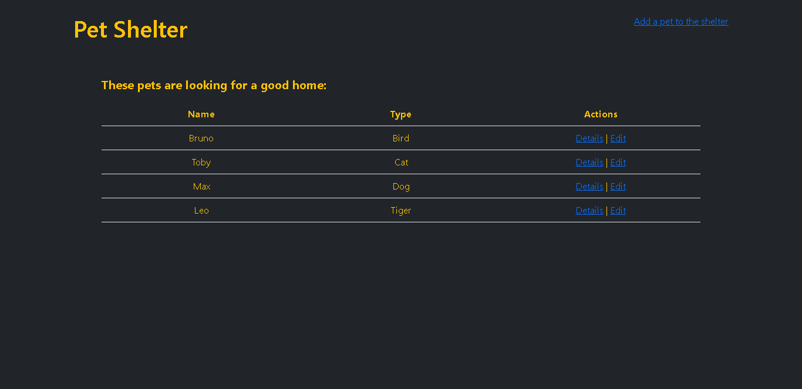

# Pet Shelter - A Simple SPA

This is a practice I did to use the things I learned when I started discovering the React and Express environment. It's don't deployed on any service but with a few steps, you can try it.

## Table of contents

- [Built with](#built-with)
- [What i learned](#what-i-learned)
- [Result](#result)
- [Try it yourself](#try-it-yourself)

## Built with

- Semantic HTML5 markup
- Mobile-first workflow
- [Bootstrap](https://getbootstrap.com/)
- [React](https://reactjs.org/docs/getting-started.html)
- [React Router](https://reactrouter.com/docs/en/v6)
- [Socket.IO](https://socket.io/)
- [Moongose](https://mongoosejs.com/docs/)
- [Express](https://expressjs.com/)

## What I learned

I mainly learned a little about how the workflow is with REACT environment (client/contexts/router/hooks), and how this can be combined with the EXPRESS workflow (api/db).

## Result

## Try it yourself

1. You have to have MongoDB installed in your computer and can connect with it with a URL like _**mongodb://localhost:27017/db-name**_
2. Clone the repo from GitHub
3. Open a terminal and install the server dependencies with _**npm install**_
4. Go to the client dir with _**cd ./client**_ and install the client dependencies with _**npm install**_
5. Go back to the root with _**cd ..**_ and start the server with _**npm start**_
6. Go back to the client dir with _**cd ./client**_ and start the client with _**npm start**_
7. In your browser go to _**http://localhost:3000/pets**_ :)